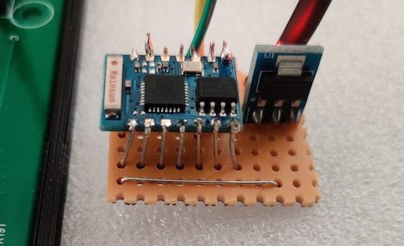
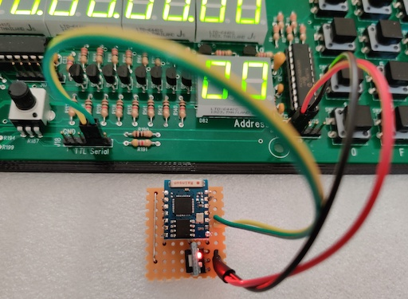

## ESP-03 (esp8266) Serial host

This project was based on [ESP8266-WiFi-UART-Bridge](https://github.com/roboremo/ESP8266-WiFi-UART-Bridge). But I had to rewrite it some to work fully so I did not fork it. Hope no one will mind.

I bought a [Single Board Relay Computer](https://www.tindie.com/products/jhallen/single-board-relay-computer/) and managed to put it together. Way faster than I imagined actually. It was pretty easy to order all the parts and I only had a couple minor problems that was easy to fix (one small solder mistake + CFLAG relay that could not hold, easy fix just swap with other relay not needing to hold).

The SBRC also has a serial interface, but I didn't want to hook it up to my computer (macbook) with dongles etc, and I had a couple ESP-03 I bought long ago but never used. So, quick solder up and program as a simple accespoint with a 9600 baud serial host. I did not use any level shifter as it seems the esp8266 has been designed to work with 5v (not on VCC!) See [Is ESP8266 I/O really 5V tolerant?](https://www.ba0sh1.com/blog/2016/08/03/is-esp8266-io-really-5v-tolerant/)





PlatformIO commands:

- `pio run` - process/build project from the current directory

- `pio run --target upload` or `pio run -t upload` - upload firmware to a target

- `pio run --target clean` - clean project (remove compiled files)

- `pio run --help` - additional information


## ESP-03 (512k) top view

```
	        [ant]
   3.3v  o----+   o  Antenna (ignore)
 GPIO14  o    +---o  CH_PD
 GPIO12  o        o  GPIO16
 GPIO13  o        o  RX
 GPIO15  o------+ o  TX
  GPIO2  o      | o  NC
  GPIO0  o-Prog-+-o  GND

```